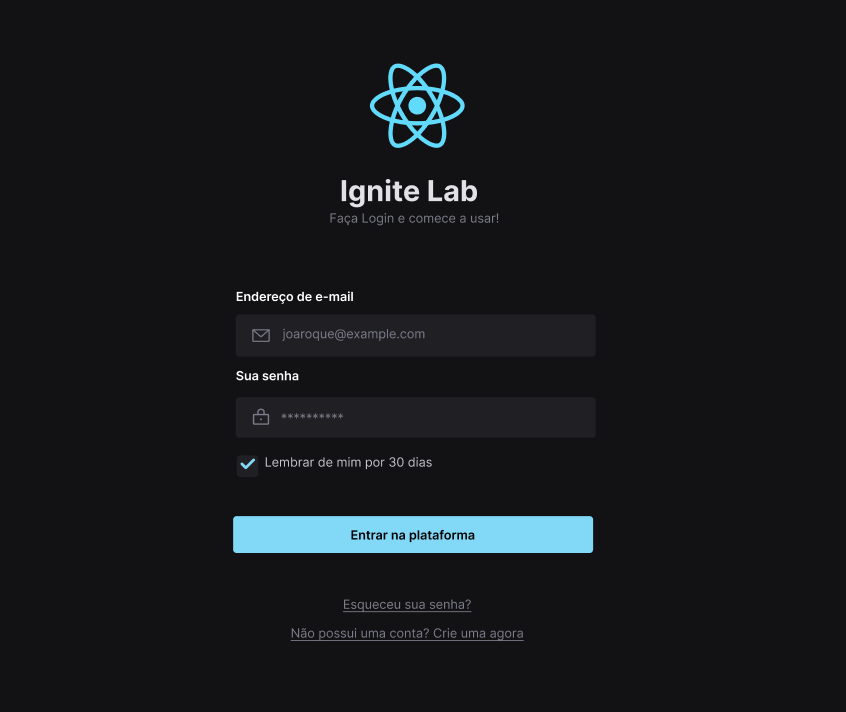

# Ignite Lab Design System

>Projecto desenvolvido durante a maratona Ignite Lab 03 🚀

## 💻Techs

### 🔗 [Figma](https://www.figma.com)

* Editor gráfico para elaboração do design system da aplicação.

## 📚Libraries

### 🔗 [Phosphor Icons](https://phosphoricons.com/)

* Uma biblioteca com uma variedade de mais de 1000 ícones.

## 🧰🔧Tools

### 🔗 [World Vector Logo](https://worldvectorlogo.com/)

* Site para download gratuito de logos.